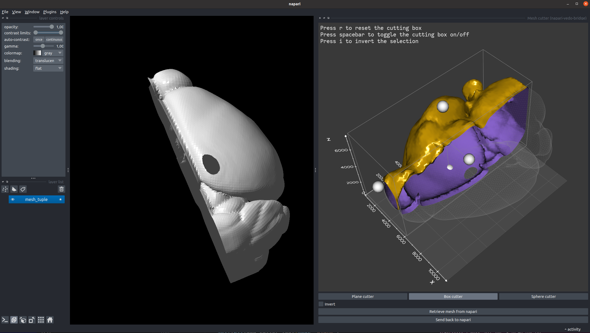

# napari-vedo-bridge

To be able to use interactive processing of meshes in napari, this plugin provides a bridge to the vedo library. It allows to transfer meshes between napari and vedo and to use the interactive processing capabilities of vedo in napari. 

## Interactive mesh cutting
To interactively cut meshes in the napari-vedo MeshCutter, install the plugin (see below) and open the plugin it from the napari plugins menu (`Plugins > Mesh Cutter (napari-vedo-bridge)`). 

To cut meshes you can use the following cutters:
- `PlaneCutter`: cuts a mesh with a plane
- `SphereCutter`: cuts a mesh with a sphere
- `BoxCutter`: cuts a mesh with a box

To send and get data into and from the plugin, you can:

- Retrieve the current mesh from napari (click `Retrieve mesh from napari`) - this imports the **currently selected mesh layer** from napari
- Load a mesh from file (click `Load mesh`)
- Send a mesh to napari (click `Send back to napari`) - this creates a new mesh layer in napari

----------------------------------

This [napari] plugin was generated with [Cookiecutter] using [@napari]'s [cookiecutter-napari-plugin] template.

<!--
Don't miss the full getting started guide to set up your new package:
https://github.com/napari/cookiecutter-napari-plugin#getting-started

and review the napari docs for plugin developers:
https://napari.org/stable/plugins/index.html
-->

## Installation

You can install `napari-vedo-bridge` via [pip]:

    pip install napari-vedo-bridge

## Contributing

Contributions are very welcome. Tests can be run with [tox], please ensure
the coverage at least stays the same before you submit a pull request.

## License

Distributed under the terms of the [BSD-3] license,
"napari-vedo-bridge" is free and open source software

## Issues

If you encounter any problems, please [file an issue] along with a detailed description.

[napari]: https://github.com/napari/napari
[Cookiecutter]: https://github.com/audreyr/cookiecutter
[@napari]: https://github.com/napari
[MIT]: http://opensource.org/licenses/MIT
[BSD-3]: http://opensource.org/licenses/BSD-3-Clause
[GNU GPL v3.0]: http://www.gnu.org/licenses/gpl-3.0.txt
[GNU LGPL v3.0]: http://www.gnu.org/licenses/lgpl-3.0.txt
[Apache Software License 2.0]: http://www.apache.org/licenses/LICENSE-2.0
[Mozilla Public License 2.0]: https://www.mozilla.org/media/MPL/2.0/index.txt
[cookiecutter-napari-plugin]: https://github.com/napari/cookiecutter-napari-plugin

[napari]: https://github.com/napari/napari
[tox]: https://tox.readthedocs.io/en/latest/
[pip]: https://pypi.org/project/pip/
[PyPI]: https://pypi.org/
